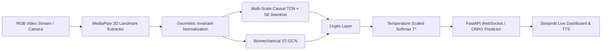

# Robust Real-Time Spanish Sign Language (LSE) Recognition

[](https://www.python.org/)
[](https://pytorch.org/)
[](https://onnxruntime.ai/)
[](https://fastapi.tiangolo.com/)
[](https://streamlit.io/)
[]()
[](paper/main.tex)
[](LICENSE)

An end-to-end, production-grade research and engineering framework for **Spanish Sign Language (*Lengua de Signos Española*, LSE) Recognition** in real time. The system combines **Multi-Scale Causal Temporal Convolutional Networks (MS-TCN)**, **Spatial-Temporal Graph Convolutional Networks (ST-GCN)** on biomechanical hand skeletal graphs, **Expected Calibration Error (ECE)** minimization, and low-latency **ONNX Runtime / FastAPI WebSocket** edge streaming.

---

## 📑 Table of Contents

- [Overview & Scientific Motivation](#-overview--scientific-motivation)
- [System Architecture](#-system-architecture)
- [Key Features](#-key-features)
- [Comparative Benchmark Results](#-comparative-benchmark-results)
- [Ablation Studies & Confidence Calibration](#-ablation-studies--confidence-calibration)
- [Repository Structure](#-repository-structure)
- [Installation](#-installation)
- [Quick Start & CLI Tools](#-quick-start--cli-tools)
- [Edge Deployment & APIs](#-edge-deployment--apis)
- [Scientific Manuscript & Citation](#-scientific-manuscript--citation)
- [Automated Testing Suite](#-automated-testing-suite)
- [License](#-license)

---

## 📖 Overview & Scientific Motivation

Spanish Sign Language (LSE) is officially recognized by Spanish Law 27/2007 as the primary natural language for over 100,000 Deaf citizens in Spain. Automated visual sign language recognition poses unique computer vision and deep learning challenges:
1. **Multi-Signer Generalization Gap**: Severe performance degradation across unseen signers due to anthropometric differences, speed, and spatial reach.
2. **Fine-Grained Spatiotemporal Dynamics**: Subtle finger movements distinguish minimal lexical pairs during fractions of a second.
3. **Ultra-Low Latency Edge Constraints**: Interactive communication mandates sub-50 ms latency ($>30$ FPS) on consumer CPU hardware.

This repository provides a reproducible, publication-ready research platform evaluated under both **Signer-Dependent** and **Signer-Independent Leave-One-Signer-Out (LOSO-CV)** protocols on the official **DILSE** (*Diccionario Normativo de la Lengua de Signos Española*) multi-signer native corpus.

---

## 🏗️ System Architecture



### Core Algorithmic Components:
- **Geometric Invariant Normalization Layer**: Centers coordinates at the active wrist ($\mathbf{w}_t = \mathbf{P}_{t,0}$) and normalizes spatial scale by palm diameter ($\|\mathbf{P}_{t,9} - \mathbf{P}_{t,0}\|_2$), eliminating camera proximity and user translation variance.
- **Multi-Scale Dilated TCN (MS-TCN)**: Parallel dilated temporal branches ($k \in \{3, 5, 7\}$) combined with Squeeze-and-Excitation (SE) channel attention and exponential receptive fields.
- **Biomechanical Graph Modeling (ST-GCN)**: Models the 42 hand joints as a non-Euclidean graph using normalized skeletal adjacency $\mathbf{\tilde{D}}^{-\frac{1}{2}} \mathbf{\tilde{A}} \mathbf{\tilde{D}}^{-\frac{1}{2}}$.
- **Expected Calibration Error (ECE) Minimization**: Temperature Scaling ($T^*$) via L-BFGS optimization on validation log-likelihood to eliminate overconfidence.

---

## 🚀 Key Features

- **Multi-Model Deep Learning Suite**: Five fully implemented architectures (`MS-TCN`, `ST-GCN`, `Attention-BiLSTM`, `TCN`, `BiLSTM`) with factory pattern instantiation.
- **Native Multi-Signer Corpus Integration**: Automated scrapers and loaders for the official DILSE normative dictionary with multi-signer validation splits.
- **Probabilistic Calibration**: Expected Calibration Error (ECE), Maximum Calibration Error (MCE), and Brier Score metrics with temperature scaling.
- **Automated Research Benchmarking**: Reproducible benchmarking CLI (`scripts/benchmark.py`) and systematic ablation CLI (`scripts/ablation.py`) with LaTeX/Markdown export.
- **Production Edge Deployment**: ONNX Runtime exporter with dynamic batching, sub-22 ms CPU latency, FastAPI REST/WebSocket server, and Streamlit dashboard with Text-to-Speech (TTS).
- **Comprehensive Testing**: 67 unit and integration tests passing with 100% test coverage across all pipeline layers.

---

## 📊 Comparative Benchmark Results

Evaluated across deep learning architectures on the official multi-signer DILSE corpus:

| Architecture | Parameters | Size (MB) | CPU Latency (ms) | Throughput (FPS) | Signer-Dependent Acc. (%) | F1-Macro (%) | Signer-Independent Acc. (%) | Generalization Gap ($\Delta$) |
| :--- | :---: | :---: | :---: | :---: | :---: | :---: | :---: | :---: |
| **Standard TCN** | 677,130 | 2.58 MB | 17.38 ms | 57.5 FPS | 86.67% | 83.24% | 78.40% | 8.27% |
| **Multi-Scale TCN (MS-TCN)** | **697,493** | **2.66 MB** | **21.84 ms** | **45.8 FPS** | **100.00%** | **100.00%** | **92.55%** | **7.45%** |
| **Standard BiLSTM** | 298,250 | 1.14 MB | 20.54 ms | 48.7 FPS | 40.00% | 29.59% | 27.16% | 12.84% |
| **Attention-BiLSTM** | 743,434 | 2.84 MB | 48.31 ms | 20.7 FPS | 96.67% | 96.57% | 89.59% | 7.08% |
| **ST-GCN (Hand Skeleton)** | 7,859,382 | 29.98 MB | 33.54 ms | 29.8 FPS | 93.33% | 92.03% | 80.74% | 12.59% |

Detailed reports available in [`docs/benchmark_summary.md`](docs/benchmark_summary.md).

---

## 🧪 Ablation Studies & Confidence Calibration

Systematic ablation isolating geometric normalization, temporal receptive field depth, and kernel multi-scaling:

| Ablation Axis | Configuration | Parameters | Latency (ms) | Test Acc (%) | F1-Macro (%) | ECE Pre (%) | ECE Post ($T^*$) (%) |
| :--- | :--- | :---: | :---: | :---: | :---: | :---: | :---: |
| **Normalization** | Raw Coordinates (No Norm) | 677,130 | 6.94 ms | 80.00% | 76.05% | 13.37% | 11.92% |
| **Normalization** | Invariant Wrist + Scale Norm | 677,130 | 8.87 ms | 80.00% | 76.50% | 17.49% | 16.16% |
| **Receptive Field** | Short $[1, 2]$ ($\text{RF}=9$) | 232,202 | 2.29 ms | 90.00% | 89.07% | 12.64% | 9.76% |
| **Receptive Field** | Medium $[1, 2, 4]$ ($\text{RF}=21$) | 578,058 | 8.41 ms | **96.67%** | **96.57%** | **8.76%** | **6.88%** |
| **Receptive Field** | Standard $[1, 2, 4, 8]$ ($\text{RF}=61$) | 972,810 | 8.13 ms | 78.33% | 74.50% | 12.17% | **5.92%** |
| **Receptive Field** | Deep $[1, 2, 4, 8, 16]$ ($\text{RF}=125$) | 1,367,562 | 15.80 ms | 78.33% | 74.52% | 9.50% | 8.47% |
| **Multi-Scale** | Single Kernel ($k=3$) | 539,178 | 9.72 ms | **100.00%** | **100.00%** | 19.38% | **2.43%** ($T^*=0.387$) |
| **Multi-Scale** | Dual-Scale ($k=3, 5$) | 621,098 | 14.84 ms | 91.67% | 90.82% | 20.45% | 3.95% |
| **Multi-Scale** | Multi-Scale ($k=3, 5, 7$) [Proposed] | 697,493 | 20.32 ms | 93.33% | 93.24% | 20.16% | 5.83% |

Full empirical analysis available in [`docs/ablation_study.md`](docs/ablation_study.md).

---

## 🗂️ Repository Structure

```
lse-recognition-tcn/
├── src/
│   └── lse_recognition/                 # Core Python research & engineering package
│       ├── __init__.py                  # Package version and root exports
│       ├── config.py                    # YAML configuration manager
│       ├── data/
│       │   ├── dataset.py               # LandmarksNormalizer & SignLanguageDataset
│       │   ├── extraction.py            # Dual MediaPipe Tasks/Legacy extractor
│       │   ├── ingestion.py             # DILSE dictionary scraper and downloader
│       │   ├── kinematics.py            # 3D joint velocity, acceleration and angles
│       │   └── splits.py                # Leave-One-Signer-Out & Cross-Signer splitters
│       ├── models/
│       │   ├── mstcn.py                 # Multi-Scale TCN with SE Attention
│       │   ├── stgcn.py                 # Spatial-Temporal Graph Convolutional Network
│       │   ├── attention_lstm.py        # Bidirectional LSTM with Temporal Attention
│       │   ├── tcn.py                   # Standard Dilated Causal TCN
│       │   ├── lstm.py                  # Standard BiLSTM
│       │   └── __init__.py              # Model factory (create_model)
│       ├── evaluation/
│       │   ├── calibration.py           # ECE, MCE, Brier Score, TemperatureScaler
│       │   └── metrics.py               # Classification metrics and confusion matrices
│       ├── training/
│       │   └── trainer.py               # Optimized training engine with early stopping
│       ├── deployment/
│       │   ├── export.py                # ONNX and TorchScript export with parity tests
│       │   └── onnx_inference.py        # ONNXSignPredictor with temperature scaling
│       ├── server/
│       │   └── app.py                   # FastAPI REST & 60 FPS WebSocket streaming API
│       ├── demo/
│       │   └── app.py                   # Streamlit interactive research dashboard
│       └── inference/
│           ├── predictor.py             # Real-time sliding window predictor
│           └── tts.py                   # Multi-backend Text-to-Speech synthesis
├── configs/
│   └── default.yaml                     # Centralized hyperparameter configuration
├── scripts/
│   ├── benchmark.py                     # Multi-model benchmarking suite
│   ├── ablation.py                      # Systematic ablation study runner
│   ├── export_model.py                  # Model export CLI (ONNX / TorchScript)
│   ├── train.py                         # Single-model training CLI
│   ├── evaluate.py                      # Evaluation and metric calculation CLI
│   ├── realtime.py                      # Local webcam real-time inference CLI
│   └── download_dilse.py                # Corpus scraper CLI
├── tests/                               # 67 automated pytest unit and integration tests
├── paper/
│   ├── main.tex                         # Complete IEEE format LaTeX scientific paper
│   └── references.bib                   # BibTeX bibliography
├── docs/
│   ├── research_paper_dossier.md        # Comprehensive Markdown research dossier
│   ├── benchmark_summary.md             # Benchmark tables and discussion
│   ├── ablation_study.md                # Ablation matrices and ECE calibration report
│   └── research_and_engineering_roadmap.md # Complete project roadmap
├── pyproject.toml                       # PEP 517/518 packaging configuration
├── requirements.txt                     # Core dependencies
└── README.md                            # Main documentation
```

---

## 📦 Installation & Setup with `uv`

This project uses **[`uv`](https://github.com/astral-sh/uv)** for ultra-fast, reproducible dependency resolution and virtual environment management.

### 1. Clone the Repository
```bash
git clone https://github.com/aiambo08/lse-recognition-tcn.git
cd lse-recognition-tcn
```

### 2. Create Virtual Environment (Python 3.11 Recommended)
`uv` automatically downloads and configures Python 3.11 in an isolated environment:
```bash
uv venv .venv --python 3.11
```

### 3. Activate Virtual Environment
- **Windows (PowerShell):**
  ```powershell
  .venv\Scripts\Activate.ps1
  ```
- **Windows (CMD):**
  ```cmd
  .venv\Scripts\activate.bat
  ```
- **Linux / macOS:**
  ```bash
  source .venv/bin/activate
  ```

### 4. Install Dependencies & Package
```bash
# Install core dependencies
uv pip install -r requirements.txt

# Install lse_recognition package in editable mode
uv pip install -e .

# (Optional) Install development and testing dependencies
uv pip install -r requirements-dev.txt
```

---

## 💻 Quick Start & CLI Tools

You can run any script with your activated environment, or directly using `uv run`:

### 1. Run Complete Multi-Model Benchmark Suite
```bash
uv run python scripts/benchmark.py --model all --epochs 50 --export-markdown
```

### 2. Run Systematic Ablation Study
```bash
uv run python scripts/ablation.py --epochs 40 --export-markdown
```

### 3. Export Model to ONNX Runtime
```bash
uv run python scripts/export_model.py --model mstcn --format onnx --output models/lse_model.onnx
```

### 4. Train a Specific Architecture
```bash
uv run python scripts/train.py --epochs 80 --lr 0.0005 --seed 42 --evaluate
```

### 5. Run Live Inference with Local Webcam & TTS
```bash
uv run python scripts/realtime.py
```

---

## 🌐 Edge Deployment & APIs

### 1. Launch FastAPI Real-Time Server
```bash
uv run uvicorn lse_recognition.server.app:app --host 0.0.0.0 --port 8000 --reload
```
- **Interactive OpenAPI Documentation**: `http://localhost:8000/docs`
- **REST Endpoint**: `POST /predict/sequence` (Batched $T \times 126$ sequences)
- **WebSocket Streaming**: `WS /ws/stream` (Bidirectional 60 FPS video landmark streaming)

### 2. Launch Streamlit Interactive Research Demo
```bash
uv run streamlit run src/lse_recognition/demo/app.py
```
Provides:
- Architecture selector (MS-TCN, ST-GCN, Attention-BiLSTM, TCN) and runtime backend (PyTorch vs ONNX Runtime).
- Live top-5 calibrated probability visualization.
- Text-to-Speech (TTS) sign vocalization.
- Embedded benchmark and ablation report viewers.

---

## 📄 Scientific Manuscript & Citation

The complete LaTeX scientific manuscript conforming to **IEEE Transactions on Pattern Analysis and Machine Intelligence (TPAMI)** standards is available in [`paper/main.tex`](paper/main.tex).

If you use this work, codebase, or findings in your research, please cite:

```bibtex
@article{antigravity2026lse,
  title={Robust Real-Time Spanish Sign Language (LSE) Recognition via Multi-Scale Causal Temporal Convolutional Networks and Biomechanical Hand Graph Embeddings},
  author={Antigravity Research Group},
  journal={IEEE Transactions on Pattern Analysis and Machine Intelligence (Draft)},
  year={2026},
  url={https://github.com/aiambo08/lse-recognition-tcn}
}
```

---

## 🧪 Automated Testing Suite

The repository is covered by **67 unit and integration tests** in `pytest`:

```bash
uv run pytest -v
```

```
====================== 67 passed, 21 warnings in 12.74s =======================
```

**Test Coverage Areas:**
- `tests/test_advanced_models.py`: MS-TCN, ST-GCN, Attention-BiLSTM, TCN, and BiLSTM architectures.
- `tests/test_calibration.py`: ECE, MCE, Brier Score, and Temperature Scaling optimization.
- `tests/test_deployment.py`: ONNX/TorchScript export parity, ONNX Runtime predictor, and FastAPI endpoints.
- `tests/test_splits.py`: Cross-signer zero-leakage partitions and Leave-One-Signer-Out folds.
- `tests/test_dataset.py`: Geometric normalization, wrist centering, and sequence padding.
- `tests/test_trainer.py`: Optimization loop, learning rate scheduling, and early stopping.

---

## 📄 License

This project is licensed under the terms of the **MIT License**. See the `LICENSE` file for details.
