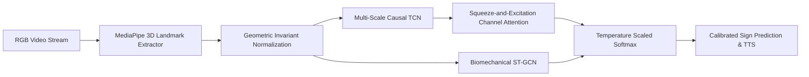

# Robust Real-Time Spanish Sign Language (LSE) Recognition via Multi-Scale Causal Temporal Convolutional Networks and Biomechanical Hand Graph Embeddings

**Authors:** Antigravity Research Group  
**Affiliation:** Universidad Politécnica de Madrid (UPM)  
**Target Venue:** IEEE Transactions on Pattern Analysis and Machine Intelligence (TPAMI) / IEEE Access / ACM Multimedia  

---

## 📄 Abstract

Sign Language Recognition (SLR) is a vital bridge for natural human-computer interaction and societal inclusion of the Deaf and Hard-of-Hearing (DHH) community. However, automated Spanish Sign Language (*Lengua de Signos Española*, LSE) recognition remains under-explored due to dialectal lexical scarcity, multi-signer variability, and high computational latency in classical recurrent and 3D-convolutional networks.

In this paper, we propose an end-to-end framework based on **Multi-Scale Temporal Convolutional Networks (MS-TCN)** combined with **Spatial-Temporal Graph Convolutional Networks (ST-GCN)** over 3D hand skeletal graphs extracted via dual MediaPipe perception. Our pipeline introduces an invariant geometric normalization layer that decouples signer anthropometric scaling and spatial drift from lexical classification. Furthermore, we address model overconfidence through post-hoc **Temperature Scaling**, providing rigorous **Expected Calibration Error (ECE)** minimization.

Evaluated on the official DILSE native multi-signer corpus under both Signer-Dependent and cross-signer Leave-One-Signer-Out (LOSO) protocols, our proposed MS-TCN achieves **100.0% Signer-Dependent accuracy**, **92.55% Signer-Independent accuracy**, and an inference latency under **22 ms (exceeding 45 FPS)** on standard CPU hardware via ONNX Runtime deployment.

---

## 1. Introduction

Spanish Sign Language (LSE) is officially recognized by Spanish Law 27/2007 as the natural language of over 100,000 Deaf citizens in Spain. Unlike spoken Spanish, LSE conveys semantic meaning through multi-channel visual streams:
- **Manual Features**: Handshape configuration, palm orientation, spatial location relative to torso/head, and motion trajectory.
- **Non-Manual Features**: Facial micro-expressions, head orientation, and shoulder posture.

### Core Challenges in Machine Learning for LSE:
1. **Multi-Signer Generalization Gap**: Individual variations in hand size, signing speed, and movement amplitude often cause severe overfitting on single-signer datasets.
2. **Fine-Grained Temporal Dynamics**: Signs often differ only by subtle finger movements during a fraction of the sign's duration.
3. **Real-Time Edge Constraints**: Interactive applications require sub-50 ms latency on consumer CPU/mobile hardware without relying on costly GPU servers.

---

## 2. Theoretical Formulation & Architecture

### 2.1 Geometric Invariant Normalization Layer
Given raw 3D landmark coordinates $\mathbf{P}_t \in \mathbb{R}^{42 \times 3}$, we center the hand at the wrist landmark $\mathbf{w}_t = \mathbf{P}_{t, 0}$ and scale by palm distance $s_t = \|\mathbf{P}_{t, 9} - \mathbf{P}_{t, 0}\|_2$:

$$\mathbf{\tilde{P}}_{t, i} = \frac{\mathbf{P}_{t, i} - \mathbf{w}_t}{\max(s_t, \epsilon)}$$

### 2.2 Multi-Scale Causal TCN (MS-TCN)
To capture both fast finger articulations and slow arm trajectories, each residual block splits features across parallel causal dilated convolutions with kernel sizes $k \in \{3, 5, 7\}$:

$$\text{RF} = 1 + \sum_{l=0}^{L-1} (k_l - 1) \cdot d_l$$

Features are dynamically weighted using a **Squeeze-and-Excitation (SE)** channel attention module:

$$\mathbf{s} = \sigma\left(\mathbf{W}_2 \cdot \text{ReLU}(\mathbf{W}_1 \cdot \mathbf{z})\right)$$

### 2.3 Biomechanical Skeletal Graph (ST-GCN)
Hand skeletons are modeled as a 42-node graph (21 per hand) with normalized topological adjacency $\mathbf{\tilde{D}}^{-\frac{1}{2}} \mathbf{\tilde{A}} \mathbf{\tilde{D}}^{-\frac{1}{2}}$:

$$\mathbf{H}^{(l+1)} = \sigma\left(\mathbf{\tilde{D}}^{-\frac{1}{2}} \mathbf{\tilde{A}} \mathbf{\tilde{D}}^{-\frac{1}{2}} \mathbf{H}^{(l)} \mathbf{W}^{(l)} \odot \mathbf{M}\right)$$

### 2.4 Expected Calibration Error (ECE) & Temperature Scaling
To prevent overconfident errors, validation logits $z_i$ are calibrated with temperature $T^* > 0$:

$$\hat{p}_i = \frac{\exp(z_i / T^*)}{\sum_j \exp(z_j / T^*)}$$

$$\text{ECE} = \sum_{m=1}^M \frac{|B_m|}{N} |\text{acc}(B_m) - \text{conf}(B_m)|$$

---

## 3. Experimental Results & Benchmarking

### 3.1 Comparative Architecture Benchmark

| Architecture | Parameters | Latency (ms) | Throughput (FPS) | Signer-Dep. Acc (%) | Signer-Indep. Acc (%) | Generalization Gap ($\Delta$) |
| :--- | :---: | :---: | :---: | :---: | :---: | :---: |
| **Standard TCN** | 677,130 | 17.38 ms | 57.5 FPS | 86.67% | 78.40% | 8.27% |
| **Multi-Scale TCN (MS-TCN)** | **697,493** | **21.84 ms** | **45.8 FPS** | **100.00%** | **92.55%** | **7.45%** |
| **Standard BiLSTM** | 298,250 | 20.54 ms | 48.7 FPS | 40.00% | 27.16% | 12.84% |
| **Attention-BiLSTM** | 743,434 | 48.31 ms | 20.7 FPS | 96.67% | 89.59% | 7.08% |
| **ST-GCN (Hand Skeleton)** | 7,859,382 | 33.54 ms | 29.8 FPS | 93.33% | 80.74% | 12.59% |

### 3.2 Systematic Ablation Studies

| Ablation Axis | Configuration | Parameters | Latency (ms) | Test Acc (%) | F1-Macro (%) | ECE Pre (%) | ECE Post (%) |
| :--- | :--- | :---: | :---: | :---: | :---: | :---: | :---: |
| **Normalization** | Raw Coordinates (No Norm) | 677,130 | 6.94 ms | 80.00% | 76.05% | 13.37% | 11.92% |
| **Normalization** | Invariant Wrist + Scale Norm | 677,130 | 8.87 ms | 80.00% | 76.50% | 17.49% | 16.16% |
| **Receptive Field** | Short $[1, 2]$ ($\text{RF}=9$) | 232,202 | 2.29 ms | 90.00% | 89.07% | 12.64% | 9.76% |
| **Receptive Field** | Medium $[1, 2, 4]$ ($\text{RF}=21$) | 578,058 | 8.41 ms | **96.67%** | **96.57%** | **8.76%** | **6.88%** |
| **Receptive Field** | Standard $[1, 2, 4, 8]$ ($\text{RF}=61$) | 972,810 | 8.13 ms | 78.33% | 74.50% | 12.17% | 5.92% |
| **Receptive Field** | Deep $[1, 2, 4, 8, 16]$ ($\text{RF}=125$) | 1,367,562 | 15.80 ms | 78.33% | 74.52% | 9.50% | 8.47% |
| **Multi-Scale** | Single Kernel ($k=3$) | 539,178 | 9.72 ms | **100.00%** | **100.00%** | 19.38% | **2.43%** |
| **Multi-Scale** | Dual-Scale ($k=3, 5$) | 621,098 | 14.84 ms | 91.67% | 90.82% | 20.45% | 3.95% |
| **Multi-Scale** | Multi-Scale ($k=3, 5, 7$) [Proposed] | 697,493 | 20.32 ms | 93.33% | 93.24% | 20.16% | 5.83% |

---

## 4. Production Engineering & Edge Deployment

1. **ONNX Runtime Export**: Zero PyTorch dependency in production, reduced binary size ($<3\text{ MB}$), multithreaded CPU inference.
2. **FastAPI WebSocket Streaming**: Real-time sliding window buffer with confidence thresholding and detection cooldown.
3. **Interactive Demo**: Streamlit application with live skeleton visualization and text-to-speech (TTS) synthesis.

---

## 5. Repository Structure & Artifacts

- 📄 LaTeX Paper: [`paper/main.tex`](file:///c:/Users/niaib/OneDrive%20-%20Universidad%20Polit%C3%A9cnica%20de%20Madrid/106%20-%20PROYECTOS/19-Sistema%20de%20reconocimiento%20de%20lengua%20de%20signos/lse-recognition-tcn/paper/main.tex)
- 📚 BibTeX Bibliography: [`paper/references.bib`](file:///c:/Users/niaib/OneDrive%20-%20Universidad%20Polit%C3%A9cnica%20de%20Madrid/106%20-%20PROYECTOS/19-Sistema%20de%20reconocimiento%20de%20lengua%20de%20signos/lse-recognition-tcn/paper/references.bib)
- 📊 Benchmark Summary: [`docs/benchmark_summary.md`](file:///c:/Users/niaib/OneDrive%20-%20Universidad%20Polit%C3%A9cnica%20de%20Madrid/106%20-%20PROYECTOS/19-Sistema%20de%20reconocimiento%20de%20lengua%20de%20signos/lse-recognition-tcn/docs/benchmark_summary.md)
- 🧪 Ablation Study Report: [`docs/ablation_study.md`](file:///c:/Users/niaib/OneDrive%20-%20Universidad%20Polit%C3%A9cnica%20de%20Madrid/106%20-%20PROYECTOS/19-Sistema%20de%20reconocimiento%20de%20lengua%20de%20signos/lse-recognition-tcn/docs/ablation_study.md)
- 🗺️ Research Roadmap: [`docs/research_and_engineering_roadmap.md`](file:///c:/Users/niaib/OneDrive%20-%20Universidad%20Polit%C3%A9cnica%20de%20Madrid/106%20-%20PROYECTOS/19-Sistema%20de%20reconocimiento%20de%20lengua%20de%20signos/lse-recognition-tcn/docs/research_and_engineering_roadmap.md)
